# DeepResearchAgent

[](https://skyworkai.github.io/DeepResearchAgent/)
[](https://arxiv.org/abs/2506.12508)
[](LICENSE)

English | [🌐 **Website**](https://skyworkai.github.io/DeepResearchAgent/)

> 🔧 **Migration Notice**: This fork has been migrated from Poetry to uv and upgraded to Python 3.13. See [CHANGELOG.md](CHANGELOG.md) for details and [FORK_MANAGEMENT.md](docs/management/FORK_MANAGEMENT.md) for sync strategies.

---

## 🚫 **IMPORTANT: Local-Only Development**

> ⚠️ **All GitHub Actions are DISABLED** to prevent charges. This repository runs **100% locally**.
>
> **📖 [Local Development Guide →](LOCAL_DEVELOPMENT.md)**
>
> **🧪 Run Local CI/CD**: `./scripts/local_ci_cd.sh` (no charges, full validation)

---rchAgent

[](https://skyworkai.github.io/DeepResearchAgent/)
[](https://arxiv.org/abs/2506.12508)
[](LICENSE)

English | [🌐 **Website**](https://skyworkai.github.io/DeepResearchAgent/)

> 🔧 **Migration Notice**: This fork has been migrated from Poetry to uv and upgraded to Python 3.13. See [CHANGELOG.md](CHANGELOG.md) for details and [FORK_MANAGEMENT.md](docs/management/FORK_MANAGEMENT.md) for sync strategies.

---

## 🚀 **Upcoming Major Enhancement: Guardian Agents Integration**

> **🎯 Vision**: Enhance DeepResearchAgent's research capabilities by integrating specialized agents from [Claude Guardian Agents](https://github.com/kairin/claude-guardian-agents) while maintaining focus on research excellence.

### **📊 Planned Integration**
- **Agent Expansion**: 5 existing agents + 52 Guardian agents for broader specialization
- **Enhanced Capabilities**: Research focus + development workflow support
- **Coordination**: Multi-agent collaboration alongside existing functionality
- **Framework**: Guardian Agents oversight and quality assurance integration

### **🎯 Key Integration Areas**
- **🧠 Research Intelligence**: Additional Think-Tank reasoning agents (First Principles, Creative Thinking, Mathematical Analysis)
- **🏗️ Technical Architecture**: Technical planning agents including CTO and Principal Architect specializations
- **⚙️ Development Engineering**: Development-focused agents covering full-stack and quality engineering
- **🛡️ Operations & Security**: Operations and security-focused agents for deployment and compliance
- **📊 Strategic Management**: Product management and business development specialized agents

**📋 [View Detailed Integration Roadmap →](docs/integration/INTEGRATION_ROADMAP.md)**

---

## Introduction

```mermaid
graph TB
    subgraph Current["🔄 Current State: 5 Agents"]
        PA[🧠 Planning Agent<br/>Top-Level Coordination]
        DA[🔍 Deep Analyzer<br/>Information Analysis]
        DR[🔬 Deep Researcher<br/>Research & Synthesis]
        BU[🌐 Browser Use<br/>Web Automation]
        MM[🔧 MCP Manager<br/>Tool Orchestration]
        GT[⚙️ General Tool<br/>Function Calling]

        PA --> DA
        PA --> DR
        PA --> BU
        PA --> MM
        PA --> GT
    end

    subgraph Arrow["⚡ INTEGRATION TRANSFORMATION"]
        Transform["5 → 57+ Agents<br/>Research Tool → Complete Platform<br/>Manual → Intelligent Auto-Routing"]
    end

    subgraph Target["🚀 Target State: 57+ Agents"]
        MO[🎯 Meta-Orchestrator<br/>Intelligent Coordination]

        subgraph RI["🧠 Research Intelligence (12)"]
            RI1[Think-Tank Reasoning]
            RI2[First Principles Analysis]
            RI3[Creative Thinking]
            RI4[Systems Analysis]
        end

        subgraph TA["🏗️ Technical Architecture (5)"]
            TA1[CTO Agent]
            TA2[Principal Architect]
            TA3[System Design]
            TA4[Tech Strategy]
        end

        subgraph DE["⚙️ Development Engineering (25)"]
            DE1[Backend Development]
            DE2[Frontend Development]
            DE3[Quality Engineering]
            DE4[Mobile Development]
        end

        subgraph OS["🛡️ Operations & Security (10)"]
            OS1[DevOps Management]
            OS2[Security Compliance]
            OS3[Performance Optimization]
            OS4[Infrastructure]
        end

        subgraph SM["📊 Strategic Management (25)"]
            SM1[Product Leadership]
            SM2[Business Strategy]
            SM3[UX Research]
            SM4[Market Analysis]
        end

        MO --> RI
        MO --> TA
        MO --> DE
        MO --> OS
        MO --> SM
    end

    subgraph Benefits["✨ Integration Benefits"]
        B1["🧠 Enhanced Research<br/>Multi-perspective analysis<br/>First principles reasoning"]
        B2["🏗️ Technical Planning<br/>Architecture specialization<br/>System design support"]
        B3["⚙️ Development Support<br/>Engineering workflows<br/>Quality processes"]
        B4["🛡️ Operations Focus<br/>Security awareness<br/>Deployment processes"]
        B5["📊 Strategic Planning<br/>Product management<br/>Business development"]
    end

    Current --> Arrow
    Arrow --> Target
    Target --> Benefits

    classDef currentBox fill:#1e293b,stroke:#fbbf24,stroke-width:2px,color:#fff
    classDef targetBox fill:#0f172a,stroke:#10b981,stroke-width:2px,color:#fff
    classDef benefitBox fill:#374151,stroke:#a855f7,stroke-width:2px,color:#fff
    classDef agentBox fill:#059669,stroke:#047857,stroke-width:1px,color:#fff
    classDef clusterBox fill:#1e40af,stroke:#1d4ed8,stroke-width:1px,color:#fff

    class Current,PA,DA,DR,BU,MM,GT currentBox
    class Target,MO,RI,TA,DE,OS,SM,RI1,RI2,RI3,RI4,TA1,TA2,TA3,TA4,DE1,DE2,DE3,DE4,OS1,OS2,OS3,OS4,SM1,SM2,SM3,SM4 targetBox
    class Benefits,B1,B2,B3,B4,B5 benefitBox
```




**Original Vision**: DeepResearchAgent was conceived by [SkyworkAI](https://github.com/SkyworkAI/DeepResearchAgent) as a hierarchical multi-agent system designed for deep research tasks and general-purpose task solving. The framework leverages a top-level planning agent to coordinate multiple specialized lower-level agents, enabling automated task decomposition and efficient execution across diverse and complex domains.

**Fork Enhancement**: This enhanced fork extends the original research-focused framework with additional specialized agents from the Guardian Agents collection. The integration adds complementary capabilities while preserving DeepResearchAgent's core research mission and proven architecture.

> 🌐 **Original Research**: [https://skyworkai.github.io/DeepResearchAgent/](https://skyworkai.github.io/DeepResearchAgent/) - Explore the foundational architecture, experiments, and academic research.
> 🚀 **Integration Plan**: See [INTEGRATION_ROADMAP.md](docs/integration/INTEGRATION_ROADMAP.md) for the Guardian Agents integration approach.

## Architecture

<p align="center">

  

</p>

The system adopts a two-layer structure:

### 1. Top-Level Planning Agent

* Responsible for understanding, decomposing, and planning the overall workflow for a given task.
* Breaks down tasks into manageable sub-tasks and assigns them to appropriate lower-level agents.
* Dynamically coordinates the collaboration among agents to ensure smooth task completion.

### 2. Specialized Lower-Level Agents

* **Deep Analyzer**

  * Performs in-depth analysis of input information, extracting key insights and potential requirements.
  * Supports analysis of various data types, including text and structured data.
* **Deep Researcher**

  * Conducts thorough research on specified topics or questions, retrieving and synthesizing high-quality information.
  * Capable of generating research reports or knowledge summaries automatically.
* **Browser Use**

  * Automates browser operations, supporting web search, information extraction, and data collection tasks.
  * Assists the Deep Researcher in acquiring up-to-date information from the internet.
  
* **MCP Manager Agent**
  * Manages and orchestrates Model Context Protocol (MCP) tools and services.
  * Enables dynamic tool discovery, registration, and execution through MCP standards.
  * Supports both local and remote MCP tool integration for enhanced agent capabilities.

* **General Tool Calling Agent**
  * Provides a general-purpose interface for invoking various tools and APIs.
  * Supports function calling, allowing the agent to execute specific tasks or retrieve information from external services.

## Features

- Hierarchical agent collaboration for complex and dynamic task scenarios
- Extensible agent system, allowing easy integration of additional specialized agents
- Automated information analysis, research, and web interaction capabilities
- Secure Python code execution environment for tools, featuring configurable import controls, restricted built-ins, attribute access limitations, and resource limits. (See [PythonInterpreterTool Sandboxing](./docs/python_interpreter_sandbox.md) for details).
- Support for asynchronous operations, enabling efficient handling of multiple tasks and agents
- Support for local and remote model inference, including OpenAI, Anthropic, Google LLMs, and local Qwen models via vLLM
- Support for image and video generation tools based on the Imagen and Veo3 models, respectively

Image and Video Examples:
<p align="center">
  
    
</p>

## Updates

### Fork-Specific Updates
* **2025.09.15**: **BREAKING** - Complete migration from Poetry to uv for dependency management
* **2025.09.15**: **BREAKING** - Upgraded default Python version to 3.13 (Ubuntu 25.04+ system Python)
* **2025.09.15**: Added comprehensive validation scripts and migration documentation
* **2025.09.15**: Fixed circular imports and Python 3.13 compatibility issues
* **2025.09.15**: Updated all dependencies to latest compatible versions (420+ packages)

### Upstream Updates
* **2025.08.04**: Add the support for loading mcp tools from the local json file.
* **2025.07.08**: Add the video generator tool, which can generate a video based on the input text and/or image. The video generator tool is based on the Veo3 model.
* **2025.07.08**: Add the image generator tool, which can generate images based on the input text. The image generator tool is based on the Imagen model.
* **2025.07.07**: Due to the limited flexibility of TOML configuration files, we have switched to using the config format supported by mmengine.
* **2025.06.20**: Add the support for the mcp (Both the local mcp and remote mcp).
* **2025.06.17**: Update technical report https://arxiv.org/pdf/2506.12508.
* **2025.06.01**: Update the browser-use to 0.1.48.
* **2025.05.30**: Convert the sub agent to a function call. Planning agent can now be gpt-4.1 or gemini-2.5-pro.
* **2025.05.27**: Support OpenAI, Anthropic, Google LLMs, and local Qwen models (via vLLM, see details in [Usage](#usage)).

## TODO List

* [x] Asynchronous feature completed
* [x] Image Generator Tool completed
* [x] Video Generator Tool completed
* [x] MCP in progress
* [x] Load local MCP tools from JSON file completed

### Upstream Planned Features
* [ ] **AI4Research Agent** - Planned by [original repo owners](https://github.com/SkyworkAI/DeepResearchAgent)
* [ ] **Novel Writing Agent** - Planned by [original repo owners](https://github.com/SkyworkAI/DeepResearchAgent)

### Fork-Specific Variations
For custom agent implementations and variations, see [claude-guardian-agents](https://github.com/kairin/claude-guardian-agents) which provides alternative approaches and specialized agent architectures.

## Installation

### Using uv (Recommended)

uv is a fast Python package and project manager written in Rust. Install it first:

```bash
# Install uv (if not already installed)
curl -LsSf https://astral.sh/uv/install.sh | sh

# Quick setup with uv
uv sync --all-extras
uv run playwright install chromium --with-deps --no-shell

# Or use make commands
make venv        # Create virtual environment
make install     # Install all dependencies
```

### Ubuntu 25.04+ with Python 3.13 (Recommended)

For Ubuntu 25.04+ users with system Python 3.13:

```bash
# Use system Python
make venv-system
make install

# Or specify Python version
PYTHON_VERSION=3.13 make venv
make install
```

### Alternative Installation Methods

If you prefer not to use uv, you can still use pip:

```bash
# Create virtual environment manually
python -m venv .venv
source .venv/bin/activate  # On Windows: .venv\Scripts\activate

# Install dependencies
uv sync
uv run playwright install chromium --with-deps --no-shell
```

### Set Up `.env`

Please refer to the `.env.template` file and create a `.env` file in the root directory of the project. This file is used to configure API keys and other environment variables.

Refer to the following instructions to obtain the necessary google gemini-2.5-pro API key and set it in the `.env` file:

* [https://aistudio.google.com/app/apikey](https://aistudio.google.com/app/apikey)
* [https://cloud.google.com/docs/authentication/application-default-credentials?hl=zh-cn](https://cloud.google.com/docs/authentication/application-default-credentials?hl=zh-cn)

```bash
brew install --cask google-cloud-sdk
gcloud init
gcloud auth application-default login
```

## Usage

### Main Example
A simple example to demonstrate the usage of the DeepResearchAgent framework.
```bash
# Using uv (recommended)
uv run python main.py

# Or using make
make run

# Or in activated environment
python main.py
```

### Run Single Agent Examples
```bash
# General agent example
uv run python examples/run_general.py
# or: make run-general

# GAIA benchmark evaluation
uv run python examples/run_gaia.py
# or: make run-gaia

# High-level evaluation
uv run python examples/run_hle.py
# or: make run-hle
```

## 🔗 Using DeepResearchAgent on External Projects

**DeepResearchAgent is designed to be used as a standalone research tool across multiple projects.** Keep DeepResearchAgent in its own directory and use it to analyze any project or dataset.

### Recommended Multi-Project Usage

```bash
# 1. Keep DeepResearchAgent in its dedicated directory
cd /path/to/DeepResearchAgent

# 2. Create project-specific configurations
cp configs/config_cli_fallback.py configs/config_my_project.py

# 3. Run research tasks on any project
uv run python main.py --config configs/config_my_project.py \
    --task "Analyze the codebase in /path/to/my_project"

# 4. Create wrapper scripts for convenience (optional)
echo '#!/bin/bash
cd /path/to/DeepResearchAgent
uv run python main.py --config configs/config_my_project.py --task "$*"
' > /path/to/my_project/research.sh
chmod +x /path/to/my_project/research.sh
```

### Example: MonthlyKyocera Analysis

```bash
# From DeepResearchAgent directory
uv run python main.py --task "Analyze the Kyocera device management system in /home/user/projects/MonthlyKyocera"

# Or using a wrapper script
cd /home/user/projects/MonthlyKyocera
./research.sh "Generate maintenance recommendations for all devices"
```

### Benefits of This Approach

- ✅ **Clean Separation**: Research tool stays independent
- ✅ **Multi-Project**: Use on unlimited projects
- ✅ **Easy Updates**: Update DeepResearchAgent without affecting projects
- ✅ **Version Control**: Separate git histories
- ✅ **Resource Efficiency**: Single installation for all projects

### GAIA Evaluation Setup

```bash
# Download GAIA dataset
mkdir data && cd data
git clone https://huggingface.co/datasets/gaia-benchmark/GAIA

# Run evaluation
uv run python examples/run_gaia.py
```

## Experiments

We evaluated our agent on both GAIA validation and test sets, achieving state-of-the-art performance. Our system demonstrates superior performance across all difficulty levels.

<p align="center">
  
  
</p>

With the integration of the Computer Use and MCP Manager Agent, which now enables pixel-level control of the browser, our system demonstrates remarkable evolutionary capabilities. The agents can dynamically acquire and enhance their abilities through learning and adaptation, leading to significantly improved performance. The latest results show:
- **Test Set**: 83.39 (average), with 93.55 on Level 1, 83.02 on Level 2, and 65.31 on Level 3
- **Validation Set**: 82.4 (average), with 92.5 on Level 1, 83.7 on Level 2, and 57.7 on Level 3

## Questions

### 1. About Qwen Models

Our framework now supports:

* qwen2.5-7b-instruct
* qwen2.5-14b-instruct
* qwen2.5-32b-instruct

Update your config:

```toml
model_id = "qwen2.5-7b-instruct"
```

### 2. Browser Use

If problems occur, reinstall:

```bash
uv sync --all-extras
uv run playwright install chromium --with-deps --no-shell
```

### 3. Sub-Agent Calling

Function-calling is now supported natively by GPT-4.1 / Gemini 2.5 Pro. Claude-3.7-Sonnet is also recommended.

### 4. Use vllm for local models
We provide huggingface as a shortcut to the local model. Also provide vllm as a way to start services so that parallel acceleration can be provided.

#### Step 1: Launch the vLLM Inference Service

```bash
nohup bash -c 'CUDA_VISIBLE_DEVICES=0,1 python -m vllm.entrypoints.openai.api_server \
  --model /input0/Qwen3-32B \
  --served-model-name Qwen \
  --host 0.0.0.0 \
  --port 8000 \
  --max-num-seqs 16 \
  --enable-auto-tool-choice \
  --tool-call-parser hermes \
  --tensor_parallel_size 2' > vllm_qwen.log 2>&1 &
```

Update `.env`:

```bash
QWEN_API_BASE=http://localhost:8000/v1
QWEN_API_KEY="abc"
```

#### Step 2: Launch the Agent Service

```bash
python main.py
```

Example command:

```bash
Use deep_researcher_agent to search the latest papers on the topic of 'AI Agent' and then summarize it.
```

## Migration Validation

### Validate Your Installation

This fork includes comprehensive validation to ensure the migration is working correctly:

```bash
# Run comprehensive validation
uv run python scripts/validate_migration.py

# Quick validation - test core imports
uv run python -c "import src; print('✅ All imports successful!')"
```

### Migration Report

The validation script generates a detailed report at `migration_validation_report.json` with:
- Python version verification
- Virtual environment validation
- Dependency resolution checks
- Import testing
- Build system validation

### Common Issues

If validation fails:

1. **Python 3.13 not found**: Install Python 3.13 or use `make venv` instead of `make venv-system`
2. **Import errors**: Run `make clean && make install` to refresh dependencies
3. **uv not found**: Install uv with `curl -LsSf https://astral.sh/uv/install.sh | sh`

## Fork Management

This fork maintains significant changes from the upstream repository. See [FORK_MANAGEMENT.md](docs/management/FORK_MANAGEMENT.md) for:
- Sync strategies to protect your changes
- Conflict resolution guidelines
- Critical file identification
- Git protection mechanisms

### Documentation Structure

This repository uses a unified documentation approach:
- **`AGENTS.md`**: Master documentation file with comprehensive project information
- **`CLAUDE.md`**: Symlink to `AGENTS.md` (for Claude Code users)
- **`GEMINI.md`**: Symlink to `AGENTS.md` (for Gemini users)

All three files contain identical content, ensuring consistency while providing familiar entry points for different user bases.

## Acknowledgement

DeepResearchAgent is primarily inspired by the architecture of smolagents. The following improvements have been made:
- The codebase of smolagents has been modularized for better structure and organization.
- The original synchronous framework has been refactored into an asynchronous one.
- The multi-agent setup process has been optimized to make it more user-friendly and efficient.

We would like to express our gratitude to the following open source projects, which have greatly contributed to the development of this work:
- [smolagents](https://github.com/huggingface/smolagents) - A lightweight agent framework.
- [OpenManus](https://github.com/mannaandpoem/OpenManus) - An asynchronous agent framework.
- [browser-use](https://github.com/browser-use/browser-use) - An AI-powered browser automation tool.
- [crawl4ai](https://github.com/unclecode/crawl4ai) - A web crawling library for AI applications.
- [markitdown](https://github.com/microsoft/markitdown) - A tool for converting files to Markdown format.

We sincerely appreciate the efforts of all contributors and maintainers of these projects for their commitment to advancing AI technologies and making them available to the wider community.

## Contribution

Contributions and suggestions are welcome! Feel free to open issues or submit pull requests.

## Cite

```bibtex
@misc{zhang2025agentorchestrahierarchicalmultiagentframework,
      title={AgentOrchestra: A Hierarchical Multi-Agent Framework for General-Purpose Task Solving}, 
      author={Wentao Zhang, Liang Zeng, Yuzhen Xiao, Yongcong Li, Ce Cui, Yilei Zhao, Rui Hu, Yang Liu, Yahui Zhou, Bo An},
      year={2025},
      eprint={2506.12508},
      archivePrefix={arXiv},
      primaryClass={cs.AI},
      url={https://arxiv.org/abs/2506.12508}, 
}
```

---

### 🇨🇳 中文版说明文档

中文版文档已移除。本 fork 专注于 uv 迁移和 Python 3.13 升级。如需中文文档，请参考原始仓库：[SkyworkAI/DeepResearchAgent](https://github.com/SkyworkAI/DeepResearchAgent)。
