# Kyocera Agent Team Structure - GitHub-Compatible Mermaid Diagrams

## 1. Overall Team Hierarchy

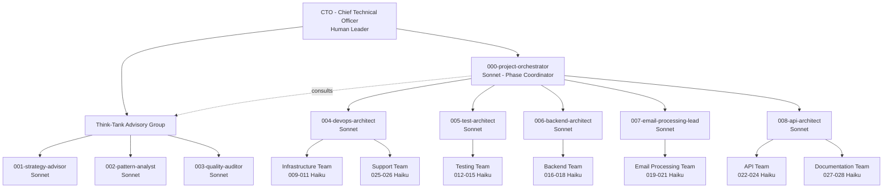

## 2. Development Phase Workflow

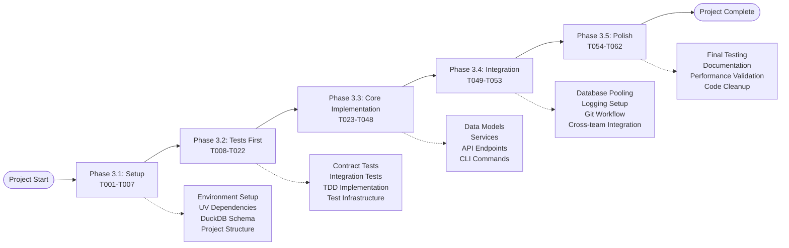

## 3. Orchestrator Coordination Workflow

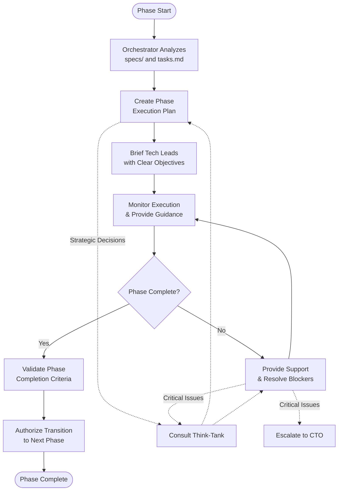

## 4. Think-Tank Advisory Process

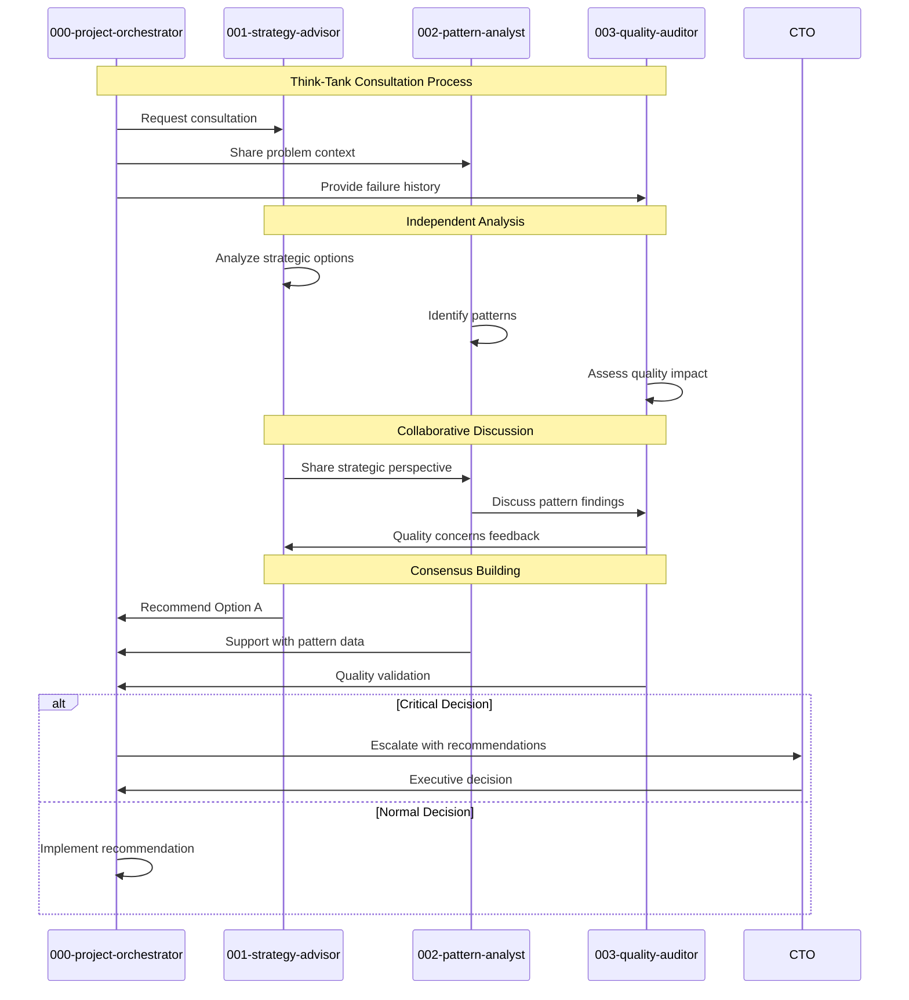

## 5. Delegation Workflow

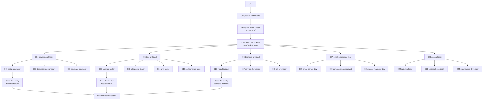

## 6. Communication Protocol Matrix

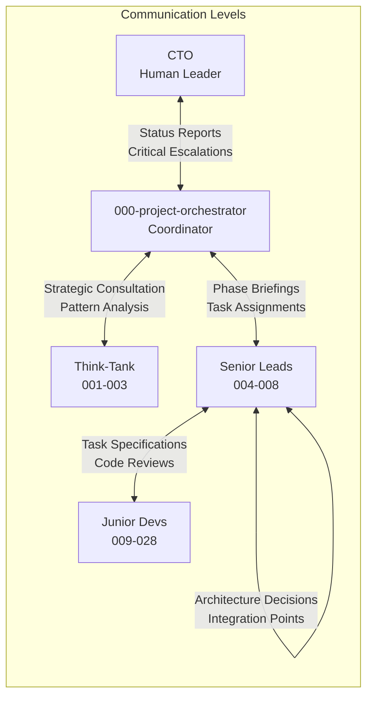

## 7. Parallel Execution Timeline

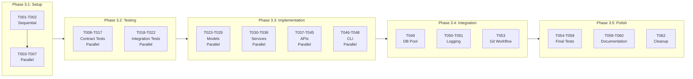

## 8. Task-to-Agent Mapping - Setup Phase

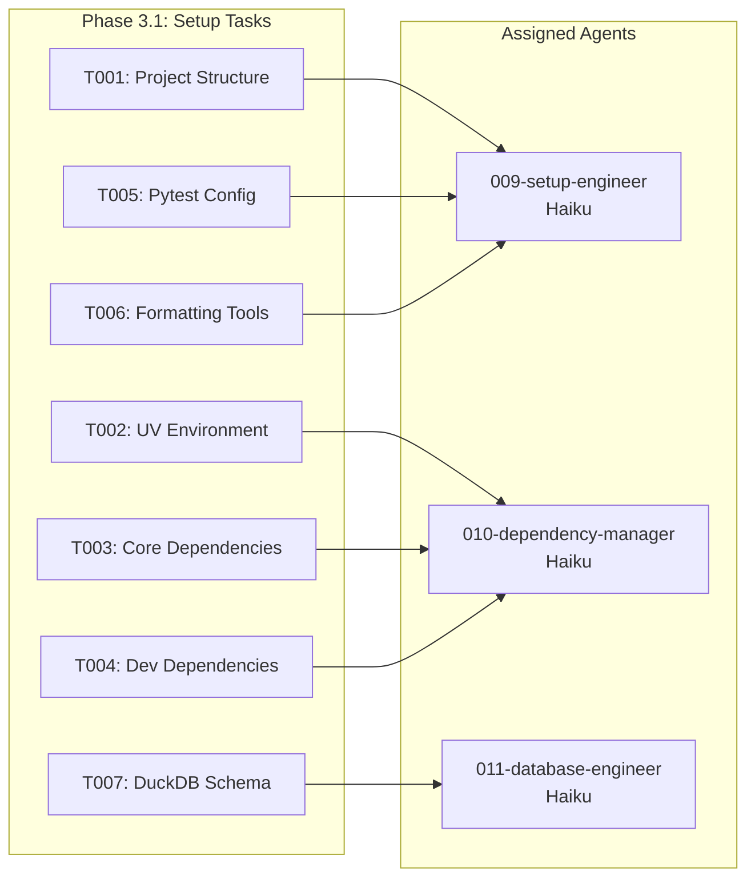

## 9. Task-to-Agent Mapping - Implementation Phase

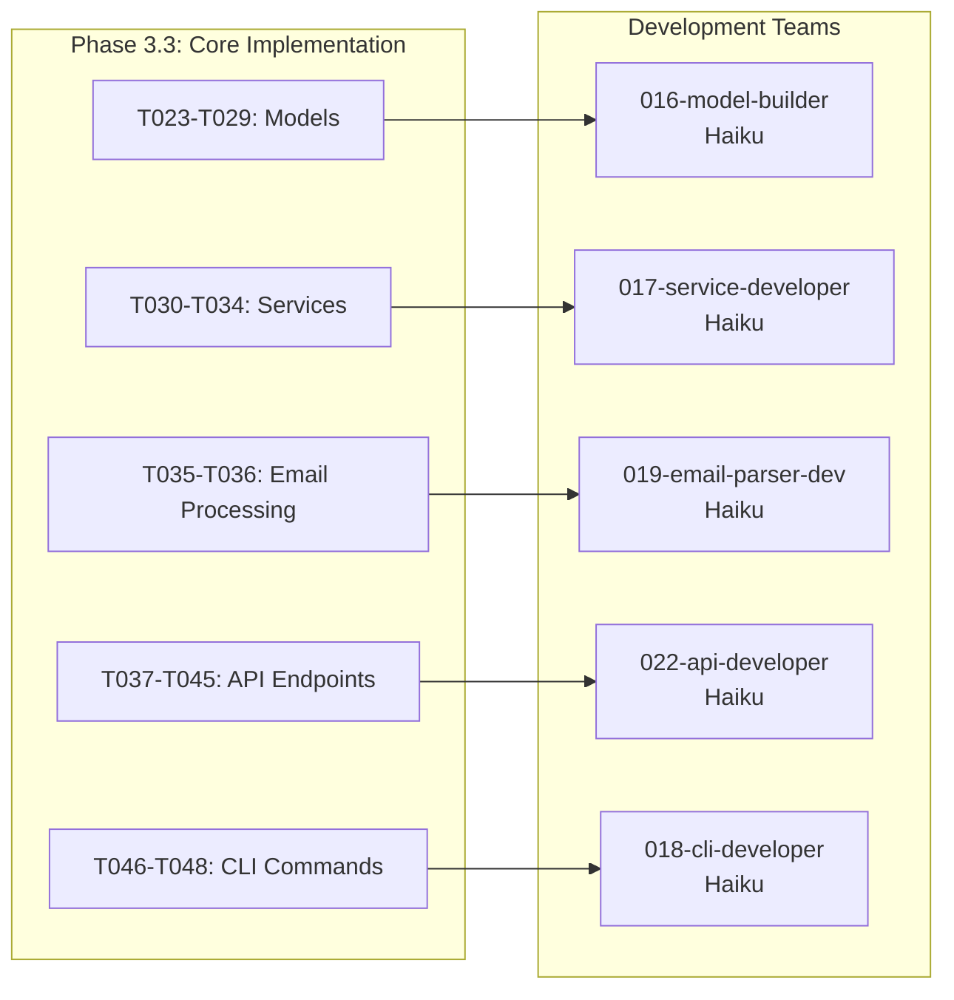

## 10. Escalation Path Workflow

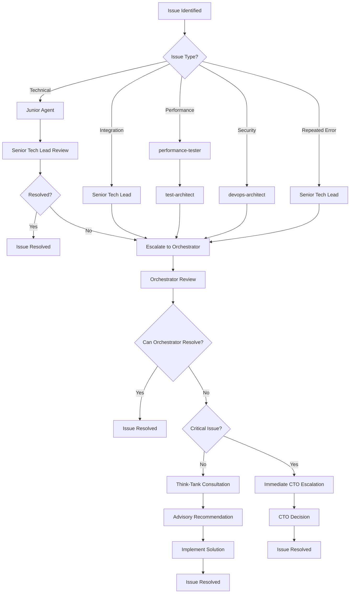

## 11. Agent Invocation Sequence

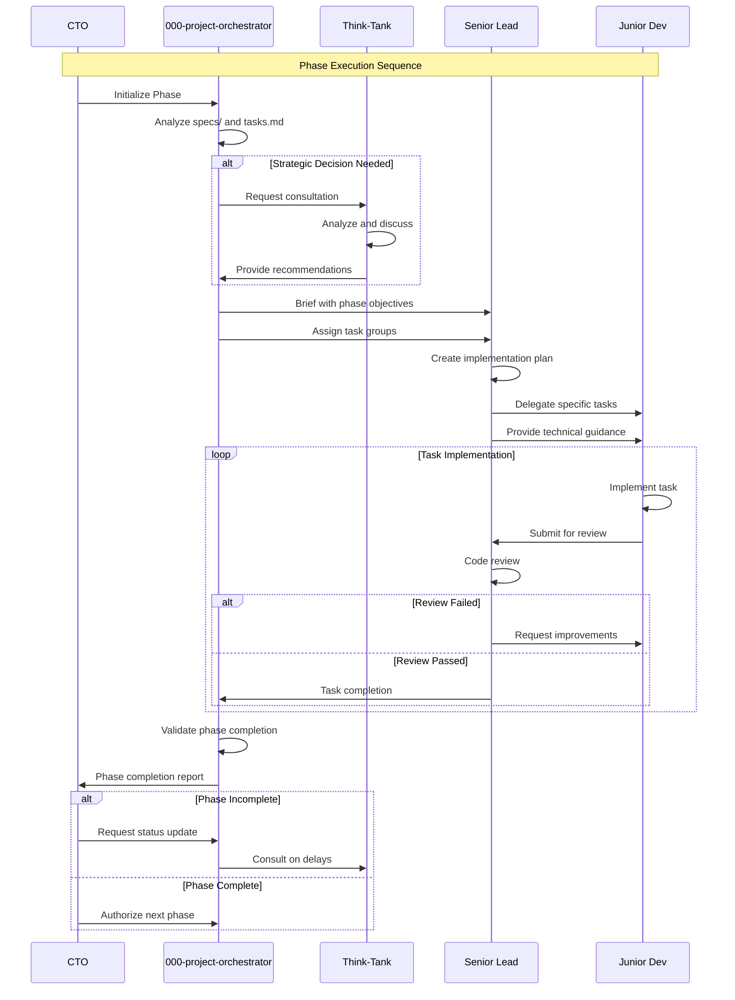

## 12. Agent Capability Matrix by Model Type

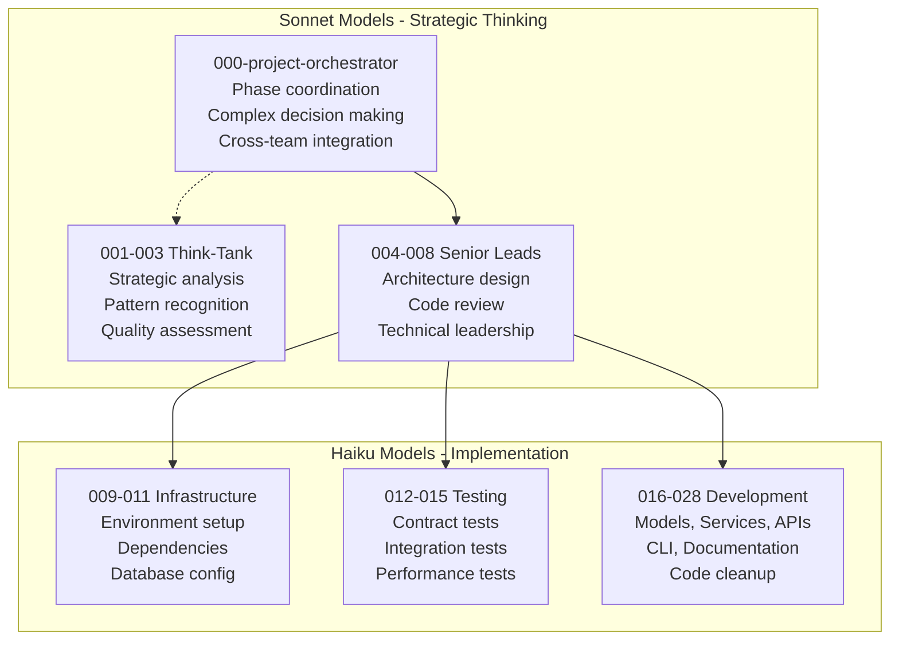

## 13. Phase-Specific Agent Usage

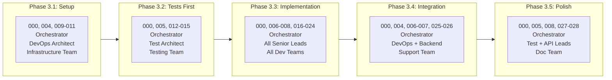
