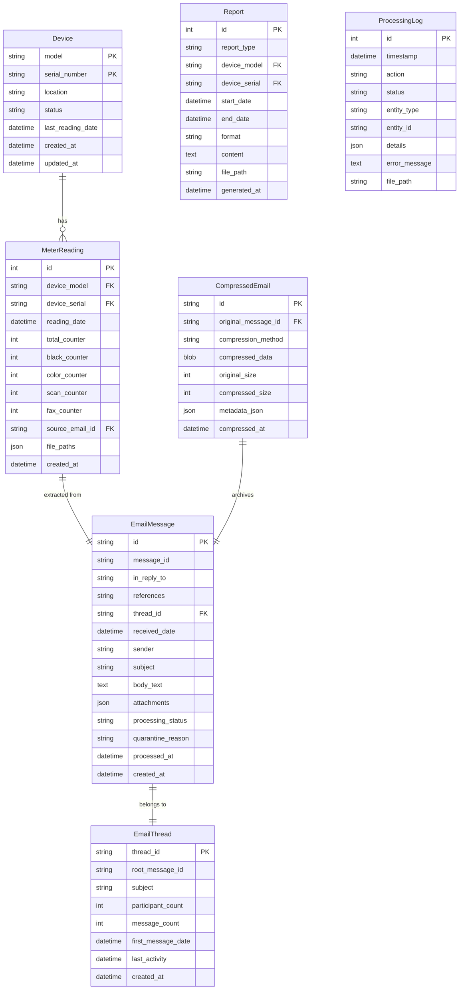

# Data Model Specification

**System**: Kyocera Meter Reading Management System  
**Version**: 1.0.0  
**Date**: 2025-09-11

## Overview

This document defines the data entities, relationships, and constraints for the Kyocera Meter Reading Management System. All entities are designed to support both operational processing and analytical reporting.

## Entity Relationship Diagram



## Entity Definitions

### Device

Represents a Kyocera office device (printer, copier, multifunction device).

| Field | Type | Constraints | Description |
|-------|------|------------|-------------|
| model | VARCHAR(100) | NOT NULL | Device model number |
| serial_number | VARCHAR(100) | NOT NULL | Unique device serial number |
| location | VARCHAR(255) | NULL | Physical location or department |
| status | VARCHAR(20) | NOT NULL DEFAULT 'active' | active, inactive, retired |
| last_reading_date | TIMESTAMP | NULL | Date of most recent meter reading |
| created_at | TIMESTAMP | NOT NULL DEFAULT NOW() | Record creation timestamp |
| updated_at | TIMESTAMP | NOT NULL DEFAULT NOW() | Last modification timestamp |

**Constraints**:
- PRIMARY KEY (model, serial_number)
- CHECK status IN ('active', 'inactive', 'retired')
- INDEX idx_device_serial ON (serial_number)
- INDEX idx_device_status ON (status)

**Business Rules**:
- Device is uniquely identified by model + serial combination
- Status transitions: active → inactive → retired (no reverse)
- Location can be updated without affecting historical readings

### MeterReading

Individual meter reading from a device at a specific point in time.

| Field | Type | Constraints | Description |
|-------|------|------------|-------------|
| id | INTEGER | PRIMARY KEY AUTOINCREMENT | Unique reading identifier |
| device_model | VARCHAR(100) | NOT NULL | Device model (FK) |
| device_serial | VARCHAR(100) | NOT NULL | Device serial (FK) |
| reading_date | DATE | NOT NULL | Date of meter reading |
| total_counter | INTEGER | NOT NULL DEFAULT 0 | Total page count |
| black_counter | INTEGER | DEFAULT 0 | Black/white page count |
| color_counter | INTEGER | DEFAULT 0 | Color page count |
| scan_counter | INTEGER | DEFAULT 0 | Scan count |
| fax_counter | INTEGER | DEFAULT 0 | Fax count |
| source_email_id | VARCHAR(100) | NOT NULL | Source email ID (FK) |
| file_paths | JSON | NOT NULL | Paths to generated files |
| created_at | TIMESTAMP | NOT NULL DEFAULT NOW() | Processing timestamp |

**Constraints**:
- FOREIGN KEY (device_model, device_serial) REFERENCES Device(model, serial_number)
- FOREIGN KEY (source_email_id) REFERENCES EmailMessage(id)
- UNIQUE KEY (device_model, device_serial, reading_date, created_at)
- CHECK total_counter >= 0
- CHECK black_counter >= 0
- CHECK color_counter >= 0
- INDEX idx_reading_date ON (reading_date)
- INDEX idx_device_reading ON (device_model, device_serial, reading_date DESC)

**Business Rules**:
- Multiple readings per day allowed (different created_at)
- Counters should be monotonically increasing (warning if not)
- file_paths JSON structure: `{"pdf": "path", "txt": "path", "md": "path", "yaml": "path"}`

### EmailMessage

Original email containing meter reading data.

| Field | Type | Constraints | Description |
|-------|------|------------|-------------|
| id | VARCHAR(100) | PRIMARY KEY | Unique email identifier (hash) |
| message_id | VARCHAR(255) | NOT NULL UNIQUE | RFC 822 Message-ID header |
| in_reply_to | VARCHAR(255) | NULL | In-Reply-To header for threading |
| references | TEXT | NULL | References header for thread chain |
| thread_id | VARCHAR(100) | NULL | Thread identifier (FK) |
| received_date | TIMESTAMP | NOT NULL | Email received timestamp |
| sender | VARCHAR(255) | NOT NULL | Sender email address |
| subject | VARCHAR(500) | NULL | Email subject line |
| body_text | TEXT | NULL | Plain text email body |
| attachments | JSON | NULL | List of attachment metadata |
| processing_status | VARCHAR(20) | NOT NULL DEFAULT 'pending' | pending, processed, failed, quarantined |
| quarantine_reason | VARCHAR(500) | NULL | Reason if quarantined |
| processed_at | TIMESTAMP | NULL | Processing completion time |
| created_at | TIMESTAMP | NOT NULL DEFAULT NOW() | Record creation time |

**Constraints**:
- CHECK processing_status IN ('pending', 'processed', 'failed', 'quarantined')
- FOREIGN KEY (thread_id) REFERENCES EmailThread(thread_id)
- INDEX idx_email_status ON (processing_status)
- INDEX idx_email_date ON (received_date DESC)
- INDEX idx_email_message_id ON (message_id)
- INDEX idx_email_thread ON (thread_id)

**Business Rules**:
- ID generated from email headers hash (Message-ID + Date)
- Status transitions: pending → processed/failed/quarantined
- Quarantined emails require reason
- Original .eml file path stored in attachments JSON
- Thread relationships built from In-Reply-To and References headers
- No file size limits on input .eml files
- Large emails compressed to <10MB for archive storage

### Report

Generated reports for devices or time periods.

| Field | Type | Constraints | Description |
|-------|------|------------|-------------|
| id | INTEGER | PRIMARY KEY AUTOINCREMENT | Report identifier |
| report_type | VARCHAR(50) | NOT NULL | monthly, yearly, device, department |
| device_model | VARCHAR(100) | NULL | Device model (if device-specific) |
| device_serial | VARCHAR(100) | NULL | Device serial (if device-specific) |
| start_date | DATE | NOT NULL | Report period start |
| end_date | DATE | NOT NULL | Report period end |
| format | VARCHAR(20) | NOT NULL | pdf, excel, csv, json |
| content | TEXT | NULL | Report content (if text-based) |
| file_path | VARCHAR(500) | NULL | Path to generated file |
| generated_at | TIMESTAMP | NOT NULL DEFAULT NOW() | Generation timestamp |

**Constraints**:
- CHECK report_type IN ('monthly', 'yearly', 'device', 'department')
- CHECK format IN ('pdf', 'excel', 'csv', 'json')
- CHECK end_date >= start_date
- FOREIGN KEY (device_model, device_serial) REFERENCES Device(model, serial_number)
- INDEX idx_report_type ON (report_type)
- INDEX idx_report_dates ON (start_date, end_date)

**Business Rules**:
- Device reports require device_model and device_serial
- Department reports aggregate multiple devices
- Reports cached for 7 days after generation

### EmailThread

Represents a conversation thread of related emails.

| Field | Type | Constraints | Description |
|-------|------|------------|-------------|
| thread_id | VARCHAR(100) | PRIMARY KEY | Unique thread identifier |
| root_message_id | VARCHAR(255) | NOT NULL | Original message ID |
| subject | VARCHAR(500) | NULL | Thread subject (from root) |
| participant_count | INTEGER | NOT NULL DEFAULT 1 | Number of unique participants |
| message_count | INTEGER | NOT NULL DEFAULT 1 | Total messages in thread |
| first_message_date | TIMESTAMP | NOT NULL | Earliest message timestamp |
| last_activity | TIMESTAMP | NOT NULL | Latest message timestamp |
| created_at | TIMESTAMP | NOT NULL DEFAULT NOW() | Thread creation time |

**Constraints**:
- INDEX idx_thread_activity ON (last_activity DESC)
- INDEX idx_thread_root ON (root_message_id)

**Business Rules**:
- Thread ID generated from root message ID hash
- Automatically updated when new messages added
- Preserves complete conversation context

### CompressedEmail

Stores compressed email data for long-term archive.

| Field | Type | Constraints | Description |
|-------|------|------------|-------------|
| id | VARCHAR(100) | PRIMARY KEY | Compressed email identifier |
| original_message_id | VARCHAR(255) | NOT NULL UNIQUE | Original Message-ID (FK) |
| compression_method | VARCHAR(20) | NOT NULL | zstd, gzip, none |
| compressed_data | BLOB | NOT NULL | Compressed email content |
| original_size | INTEGER | NOT NULL | Original size in bytes |
| compressed_size | INTEGER | NOT NULL | Compressed size in bytes |
| metadata_json | JSON | NOT NULL | Headers and structure info |
| compressed_at | TIMESTAMP | NOT NULL DEFAULT NOW() | Compression timestamp |

**Constraints**:
- FOREIGN KEY (original_message_id) REFERENCES EmailMessage(message_id)
- CHECK compression_method IN ('zstd', 'gzip', 'none')
- CHECK compressed_size <= original_size
- INDEX idx_compressed_message ON (original_message_id)

**Business Rules**:
- Target compression to <10MB where possible
- Metadata preserves all headers for reconstruction
- Supports full .eml file regeneration
- Attachments compressed separately if needed

### ProcessingLog

Audit trail of all system operations.

| Field | Type | Constraints | Description |
|-------|------|------------|-------------|
| id | INTEGER | PRIMARY KEY AUTOINCREMENT | Log entry identifier |
| timestamp | TIMESTAMP | NOT NULL DEFAULT NOW() | Event timestamp |
| action | VARCHAR(100) | NOT NULL | Action performed |
| status | VARCHAR(20) | NOT NULL | success, failure, warning |
| entity_type | VARCHAR(50) | NULL | Type of entity affected |
| entity_id | VARCHAR(100) | NULL | ID of entity affected |
| details | JSON | NULL | Additional context |
| error_message | TEXT | NULL | Error details if failed |
| file_path | VARCHAR(500) | NULL | Related file path |

**Constraints**:
- CHECK status IN ('success', 'failure', 'warning')
- INDEX idx_log_timestamp ON (timestamp DESC)
- INDEX idx_log_status ON (status)
- INDEX idx_log_entity ON (entity_type, entity_id)

**Business Rules**:
- All operations must be logged
- Failures require error_message
- Details JSON for structured metadata
- Retention: 90 days for success, 1 year for failures

## Data Validation Rules

### Device Serial Number Patterns
```python
# Common Kyocera serial patterns
SERIAL_PATTERNS = [
    r'^[A-Z]{3}\d{7}$',      # e.g., ABC1234567
    r'^\d{10}$',             # e.g., 1234567890
    r'^[A-Z]{2}-\d{8}$',     # e.g., AB-12345678
]
```

### Email Processing Rules
1. **Subject Line Patterns**:
   - "Meter Reading - {MODEL} - {SERIAL}"
   - "Counter Report {DATE}"
   - "{SERIAL} Usage Report"

2. **Body Content Patterns**:
   - Look for "Serial Number:", "Model:", "Total Counter:"
   - Extract date from "Reading Date:" or email date

3. **Filename Patterns**:
   - `{serial}_{date}_meter.pdf`
   - `counter_report_{model}_{serial}.txt`

### Counter Validation
- Total counter must equal or exceed sum of individual counters
- Counters should increase over time (warning if decrease detected)
- Maximum reasonable increase: 100,000 pages/month

## State Transitions

### Email Processing States
```
pending → processing → processed
        ↓           ↓
     failed    quarantined
```

### Device Status Lifecycle
```
active → inactive → retired
```

## Indexing Strategy

### Primary Indexes
- Device: (model, serial_number) - clustered
- MeterReading: id - clustered
- EmailMessage: id - clustered

### Secondary Indexes
- Device.serial_number - for quick lookups
- MeterReading.reading_date - for time-based queries
- MeterReading.(device_model, device_serial, reading_date) - covering index
- EmailMessage.processing_status - for queue management
- ProcessingLog.timestamp - for recent activity

## Data Retention Policy

| Entity | Retention Period | Archive Strategy |
|--------|-----------------|------------------|
| Device | Permanent | Soft delete with status |
| MeterReading | 24 months active, then archive | Move to archive table |
| EmailMessage | 90 days processed, 1 year failed | Compress to <10MB and archive |
| EmailThread | Permanent while messages exist | Update counts automatically |
| CompressedEmail | 24 months minimum | Long-term archive storage |
| Report | 30 days | Regenerate on demand |
| ProcessingLog | 90 days success, 1 year failure | Rotate to archive |

## Performance Considerations

### Expected Data Volumes
- Devices: ~50-200 records
- MeterReadings: ~2,000/month, ~50,000 total
- EmailMessages: ~200/month
- ProcessingLogs: ~10,000/month

### Query Optimization
1. **Most Common Queries**:
   - Latest reading per device
   - Monthly usage by device
   - Processing queue status
   - Error investigation

2. **Optimization Strategies**:
   - Covering indexes for common queries
   - Partitioning by date (future)
   - Materialized views for dashboards
   - Connection pooling

## Migration Notes

### From Existing File System
```sql
-- Import existing device folders
INSERT INTO Device (model, serial_number, status)
SELECT DISTINCT 
    model_folder as model,
    serial_folder as serial_number,
    'active' as status
FROM folder_scan;

-- Import historical readings from files
INSERT INTO MeterReading (...)
SELECT ... FROM parsed_pdf_data;
```

### Schema Versioning
- Version tracked in schema_version table
- Forward-only migrations
- Rollback scripts maintained

## Security Considerations

### PII Handling
- Email addresses hashed in logs
- No sensitive data in ProcessingLog.details
- Audit trail for all data access

### Access Control
- Read-only views for reporting
- Row-level security for departments (future)
- API authentication required

---
*Next: Create contracts/api-spec.yaml and contracts/schema.sql*